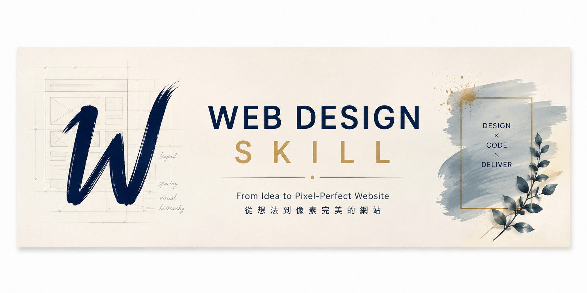
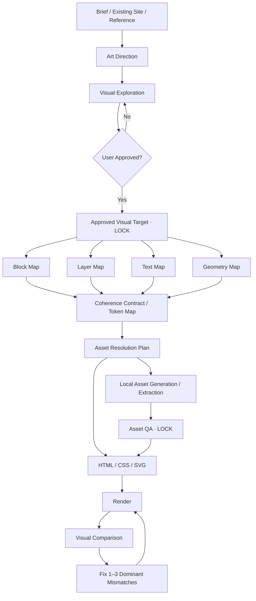

# Web Design Skill

[繁體中文](README.zh-TW.md) · **English**



> A visual-first Agent Skill for designing and reconstructing high-quality websites with explicit art direction, approved visual targets, structured decomposition, asset locking, responsive continuity, and render-based QA.

**Current version:** v1.2.1  
**Author:** max0821  
**License:** MIT  
**Commercial use:** Allowed

This is a community-built Skill and is not an official OpenAI Skill.

## Why this exists

Most AI website workflows jump directly from a text brief to HTML. That is fast, but it often produces generic layouts and a large gap between an attractive visual concept and the final implementation.

`web-design` inserts a structured design-to-code stage between concept and implementation:

```text
Understand
→ Progressive Clarification
→ Art Direction
→ Visual Exploration
→ User Reaction
→ Approved Visual Target
→ Decompose
→ Coherence Contract
→ Resolve Assets
→ Implement
→ Render
→ Compare
→ Fix
→ Repeat
```

The core idea is simple: **treat the approved visual concept as a design specification, not as disposable inspiration.**

## What makes it different

### Progressive design discovery

Instead of front-loading a long questionnaire, the Skill asks only the highest-impact unresolved question, usually with 2–4 concrete options.

### Visual-first exploration

For visually important marketing pages, redesigns, and brand-heavy work, the Skill can establish the visual direction before committing to final frontend code.

### Approved Visual Target

Once the user approves a concept, that target becomes the primary visual source of truth. The Skill should not casually re-roll the entire page later.

### Four-way decomposition

Before implementation, the approved target is decomposed into four implementation artifacts:

- **Block Map** — page sections and vertical flow.
- **Layer Map** — visual stack, overlaps, imagery, UI overlays, decoration, and z-order.
- **Text Map** — semantic copy, text hierarchy, emphasis, wrapping, and live text rules.
- **Geometry Map** — proportions, anchors, bounding regions, crop regions, and negative space.

A cross-cutting **Token Map** acts as the coherence contract shared by all four maps.

### Asset Resolution Plan

Each significant visual layer is classified before implementation:

- live HTML/UI
- CSS or SVG
- existing/cropped asset
- clean local regeneration
- omit or simplify

This keeps text, buttons, metrics, and exact UI out of generated raster images whenever possible.

### Local regeneration + asset locking

If one asset is unusable, regenerate the smallest useful asset instead of redrawing the entire approved page. Once accepted, the asset is locked so later generations do not drift the target.

### Visual coherence

The Skill explicitly checks:

- typography system
- visual grammar
- design tokens
- asset style contracts
- composition continuity
- focal hierarchy and attention budget
- image/text relationship
- motion language
- responsive continuity
- brand drift
- coherence QA

### Render-based QA

The Skill reviews the rendered page, not source code alone. Each refinement pass fixes only the **1–3 dominant mismatches** with the largest perceptual impact.

## Design-to-code model



## Repository structure

```text
web-design-skill/
├── README.md
├── README.zh-TW.md
├── LICENSE
├── CHANGELOG.md
└── web-design/
    ├── SKILL.md
    ├── README.md
    ├── README.zh-TW.md
    ├── LICENSE
    ├── agents/
    │   └── openai.yaml
    └── references/
        ├── design-system.md
        ├── visual-qa.md
        └── workflow-examples.md
```

## Install

### Install with ChatGPT

Paste this repository URL into ChatGPT:

```text
https://github.com/max0821/web-design-skill
```

Then say:

```text
Install the Agent Skill in /web-design from this repository.
Preserve the original files, directory structure, and version.
Ask me to confirm before installation.
```

On ChatGPT environments that support Skills and can read public GitHub repositories, ChatGPT may be able to prepare the Skill directly from the repository. Installation can still require an explicit confirmation step, and this flow may not be available on every account or client.

### From GitHub source

If direct installation from the repository is not available:

1. Clone or download this repository.
2. Package the `web-design/` folder as a ZIP if your Skills interface requires an archive.
3. Open the Skills interface in ChatGPT or another compatible Agent Skills client.
4. Import/upload the Skill.
5. Select `web-design` in a new chat and test it.

The actual Skill folder is `web-design/`. Its folder name intentionally matches `name: web-design` in `SKILL.md`.

## Quick version test

After installing, ask:

```text
Do not perform design work.

Based only on the currently loaded web-design Skill, answer:
1. What is metadata.version?
2. What four Maps are created after an Approved Visual Target?
3. What is the Asset Resolution Plan?
4. If one approved visual asset is dirty, should you regenerate the whole page or only that local asset?
5. How does the Skill prevent target drift?
6. Does design discovery use a long questionnaire or progressive option-based clarification?
```

For v1.2.1, expected fingerprints include:

- `metadata.version: 1.2.1`
- Block / Layer / Text / Geometry Maps
- Asset Resolution Plan
- local regeneration
- asset locking
- progressive option-based clarification
- Typography System / Visual Grammar / Token Map / Asset Style Contract
- author/license metadata

## Quality target

The Skill treats quality as four connected concerns:

- **Design Intent** — the page has a deliberate visual and business thesis.
- **Visual Fidelity** — implementation preserves the approved target.
- **Visual Coherence** — typography, assets, surfaces, composition, motion, and responsive states belong to one design language.
- **Implementation Integrity** — the result remains semantic, maintainable, accessible, and compatible with the user's architecture.

## License

Copyright © 2026 max0821.

This project is licensed under the MIT License. Commercial use, modification, redistribution, and private use are allowed, provided that the original copyright and MIT License notice are retained.

See [LICENSE](LICENSE) for the full license text.

## Versioning

The visible version is synchronized in three places:

1. `SKILL.md` → `metadata.version`
2. `SKILL.md` → visible `Version:` line near the top
3. `agents/openai.yaml` → `interface.short_description`

See [CHANGELOG.md](CHANGELOG.md) for release history.
