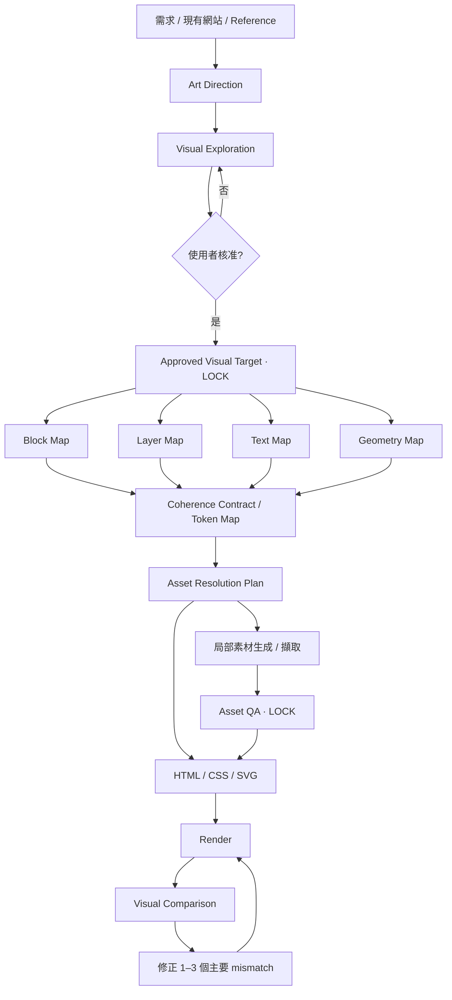

# Web Design Skill

**繁體中文** · [English](README.md)

> 一套以「視覺設計優先」為核心的 Agent Skill：從 Art Direction、視覺稿核准、結構化拆解、素材鎖定，到 Responsive continuity 與 Render-based QA，把高品質網站設計真正落到可維護的前端實作。

**目前版本：** v1.2.1  
**作者：** max0821  
**授權：** MIT License  
**商業使用：** 允許

這是社群自行建立的 Skill，並非 OpenAI 官方內建 Skill。

## 為什麼做這個 Skill

多數 AI 網站流程直接從文字需求跳到 HTML。速度很快，但通常會遇到兩個問題：第一版容易落入制式 AI UI；就算先生成一張很好看的視覺稿，真正切成 HTML 後，構圖、人物比例、字型、視覺重量與細節又會嚴重漂移。

`web-design` 在「視覺概念」與「前端實作」之間加入一個完整的設計拆解與重建階段：

```text
理解需求
→ 漸進式需求收斂
→ Art Direction
→ Visual Exploration
→ 使用者回饋
→ Approved Visual Target
→ 設計拆解
→ Coherence Contract
→ 素材解析
→ 前端實作
→ Render
→ Compare
→ Fix
→ Repeat
```

核心原則是：**核准的視覺稿不是一次性的靈感，而是後續實作的設計規格。**

## 核心特色

### 漸進式需求詢問

不先丟出長問卷。只處理當下最影響設計方向的一個問題，通常提供 2–4 個可選方向，必要時給專業建議。

### Visual-first exploration

對高視覺需求的首頁、Landing page、品牌頁或改版案，先確立真正的視覺方向，再進入最終 HTML 實作。

### Approved Visual Target

視覺稿一旦核准，就成為主要視覺 source of truth。後續不能因為局部素材不好處理，就整頁重新生成，造成 target drift。

### 四個設計拆解 Map

正式 implementation 前，把核准稿拆成：

- **Block Map** — 區塊結構、垂直流程與 section 關係。
- **Layer Map** — 背景、人物、UI overlay、裝飾、重疊與 z-order。
- **Text Map** — 真實文案、文字層級、斷行、強調方式與 live text 規則。
- **Geometry Map** — 比例、位置、anchor、bounding region、crop 與 negative space。

另外使用跨四個 Map 的 **Token Map** 作為視覺一致性的 Coherence Contract。

### Asset Resolution Plan

每個重要視覺 layer 在實作前都先分類：

- Live HTML / UI
- CSS / SVG
- 既有素材或裁切素材
- 局部重新生成乾淨素材
- 省略或簡化

精確文字、按鈕、數字、UI 元件原則上不應燒進生成圖片。

### 局部製圖 + Asset Lock

如果人物素材不乾淨，就只重新生成乾淨人物素材，而不是重做整張首頁。素材一旦驗收通過就鎖定，避免後續 generation 改變已核准方向。

### Visual Coherence

Skill 會明確維持：

- Typography System
- Visual Grammar
- Design Tokens
- Asset Style Contract
- Composition Continuity
- Focal Hierarchy / Attention Budget
- Image / Text Relationship
- Motion Language
- Responsive Continuity
- Brand Drift Detection
- Visual Coherence QA

### Render-based QA

不能只看程式碼是否能跑。必須看真正 render 的頁面，並且每輪只修正 **1–3 個最主要 mismatch**，避免無止境微調與 target drift。

## Design-to-code 流程



## Repository 結構

```text
web-design-skill/
├── README.md
├── README.zh-TW.md
├── LICENSE
├── CHANGELOG.md
└── web-design/
    ├── SKILL.md
    ├── README.md
    ├── README.zh-TW.md
    ├── LICENSE
    ├── agents/
    │   └── openai.yaml
    └── references/
        ├── design-system.md
        ├── visual-qa.md
        └── workflow-examples.md
```

## 安裝

### 從 GitHub 原始碼安裝

1. Clone 或下載這個 repository。
2. 如果 Skills 介面要求 ZIP，將 `web-design/` 資料夾本身打包成 ZIP。
3. 在 ChatGPT 或其他相容的 Agent Skills client 開啟 Skills 介面。
4. 匯入／上傳 Skill。
5. 在新對話選擇 `web-design` 後進行測試。

實際 Skill 目錄為 `web-design/`，資料夾名稱與 `SKILL.md` 裡的 `name: web-design` 保持一致。

## 快速版本驗證

安裝後可以問：

```text
不要執行任何設計工作。

請根據你目前載入的 web-design Skill 回答：
1. metadata.version 是多少？
2. Approved Visual Target 之後，要拆成哪四個 Map？
3. Asset Resolution Plan 有哪些類型？
4. 已核准視覺稿之後，如果人物素材不乾淨，應該整頁重新生成，還是局部重新生成？
5. 對已核准 asset，Skill 如何避免後續生成造成 target drift？
6. 需求資訊不足時，你應該一次問完整問卷，還是採漸進式選項詢問？
```

v1.2.1 應該能辨識出：

- `metadata.version: 1.2.1`
- Block / Layer / Text / Geometry Maps
- Asset Resolution Plan
- Local regeneration
- Asset lock
- Progressive option-based clarification
- Typography System / Visual Grammar / Token Map / Asset Style Contract
- 作者與授權 metadata

## 品質目標

這個 Skill 同時要求四件事：

- **Design Intent** — 有明確視覺與商業意圖。
- **Visual Fidelity** — 前端實作維持已核准視覺稿。
- **Visual Coherence** — 字型、素材、surface、構圖、motion 與 responsive 都屬於同一套視覺語言。
- **Implementation Integrity** — 維持語意、可維護性、accessibility 與既有架構相容性。

## 授權與版權

Copyright © 2026 max0821.

本專案採用 MIT License 授權，允許商業使用、私人使用、修改與再散布；使用或散布時必須保留原始版權聲明與 MIT License 授權聲明。

完整條款請參閱 [LICENSE](LICENSE)。

## 版本管理

版本號同步維持在三個位置：

1. `SKILL.md` → `metadata.version`
2. `SKILL.md` → 頂部可見的 `Version:`
3. `agents/openai.yaml` → `interface.short_description`

版本歷程請參閱 [CHANGELOG.md](CHANGELOG.md)。
